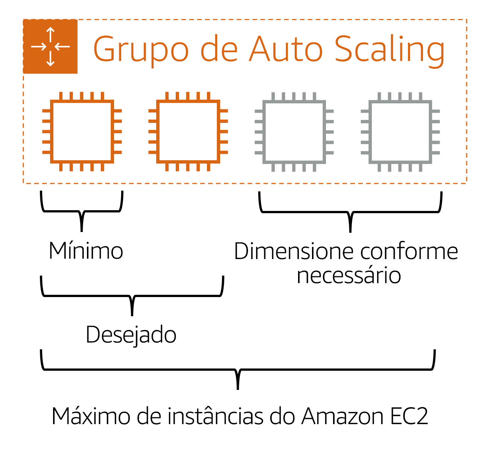

# Definição de preço da Amazon EC2;

Há varias opção de faturamento disponível na EC2. Você paga apenas pelo tempo de comutação usado. E o preço será definido de acordo com a opção escolhida.

## Sob demanda

Instância sob demandas são ideais para carga de trabalhos regulares de curto prazo que não podem ser interrrompidas. As instâncias são executadas continuamente até que sejam interrompidas e você só paga pelo tempo de computação usado. Opção não remendadas para aplicações que vão durar mais de um ano, por existir planos melhores, mas ideal para você testa a sua necessidade real em alguns meses e optar pela melhor opção dentre as opções a seguir.

O AWS Cost Explorer é uma ferramenta que permite visualizar, entender e gerenciar seus custos e uso da AWS ao longo do tempo. Se você estiver considerando suas opções para Savings Plans, o AWS Cost Explorer poderá analisar seu uso do Amazon EC2 nos últimos 7, 30 ou 60 dias. O AWS Cost Explorer também fornece recomendações personalizadas para Savings Plans.

## Savings Plans do Amazon EC2

Os Savings Plans do Amazon EC2 permitem reduzir os custos de computação comprometendo-se com uma quantidade consistente de uso de computação por um período de um ou três anos. Esse compromisso de prazo resulta em <b>economias de até 72%</b> em relação aos custos sob demanda.
 
Qualquer uso além do compromisso é cobrado de acordo com taxas regulares sob demanda.

## Instâncias reservadas

Instâncias reservadas são um desconto de faturamento aplicado ao uso de instâncias sob demanda em sua conta. Você pode comprar instâncias reservadas padrão e instâncias reservadas conversíveis por um período de um ou três anos, e instâncias reservadas agendadas por um período de um ano. Você obtém uma maior economia de custos com a opção de três anos.

## Instâncias spot

Instâncias spot são ideais para cargas de trabalho com horários de início e término flexíveis ou que podem suportar interrupções. As instâncias spot usam a capacidade de computação não utilizada do Amazon EC2 e oferecem <b>economia de custos em até 90% de desconto</b> dos preços sob demanda.

Suponha que você tenha um trabalho de processamento em segundo plano que pode iniciar e interromper conforme necessário (como o trabalho de processamento de dados para uma pesquisa de cliente). Você deseja iniciar e interromper o trabalho de processamento sem afetar as operações gerais do seu negócio. Se você fizer uma solicitação spot e a capacidade do Amazon EC2 estiver disponível, sua instância spot será iniciada. No entanto, se você fizer uma solicitação spot e a capacidade do Amazon EC2 estiver indisponível, a solicitação não será bem-sucedida até que a capacidade fique disponível. A capacidade indisponível pode atrasar o lançamento do trabalho de processamento em segundo plano.

## Hosts dedicados

Hosts dedicados são servidores físicos com capacidade de instância do Amazon EC2 totalmente dedicada ao uso do cliente. 

Você pode usar suas licenças de software existentes por soquete, por núcleo ou por VM para ajudar a manter a conformidade com a licença. Você pode comprar hosts dedicados sob demanda e reservas de hosts dedicados. De todas as opções do Amazon EC2 que foram abordadas, os hosts dedicados são os mais caros.

# Escalabilidade e elasticidade

Outro grande benefício da EC2 é a escalabilidade e elasticidade, ou como a capacidade pode crescer ou diminuir com base na necessidade do cliente. 

A <mark>escalabilidade</mark> envolve começar apenas com os recursos de que você precisa e progetar sua arquitetura para responder <b>automaticamente</b> às alterações de demanda, aumentando ou reduzindo.

## Auto Scaling

Se você quisesse que o processo de escalabilidade acontecesse automaticamente, o serviço <b>Amazon EC2 Auto Scaling</b> pode fazer isso por você.

No Amazon EC2 Auto Scaling, você pode usar duas abordagens: escalabilidade dinâmica e escalabilidade preditiva:

* <i>Escalabilidade dinâmica</i> responde às alterações na demanda;

* <i>Escalabilidade preditiva</i> programa automaticamente o número correto de instâncias do Amazon EC2 com base na demanda prevista.

Ao criar um grupo de Auto Scaling, você pode definir o número mínimo de instâncias do Amazon EC2, bem como a capacidade máxima.  A capacidade mínima é o número de instâncias do Amazon EC2 que são iniciadas imediatamente após a criação do grupo de Auto Scaling. Neste exemplo, o grupo de Auto Scaling tem uma capacidade mínima de uma instância do Amazon EC2.

Você pagará pelas instâncias usadas apenas quando elas forem usadas

OBS: Se você não especificar o número desejado de instâncias do Amazon EC2 em um grupo de Auto Scaling, a capacidade desejada assumirá o padrão de sua capacidade mínima.

